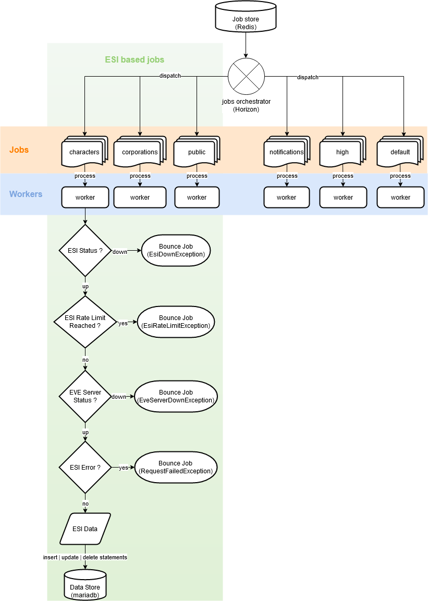

# Job Queue Flow

When a job is queued, it's instance is serialized and push into the Redis database.
Horizon, our jobs orchestrator is taking care of every new jobs falling in redis and push it to an available worker from the targeted queue.

With SeAT 4, queues have been renamed and are scoped.
This help to identify load per "topic" and ensure a better parallel processing of jobs.

As shown bellow, queues `characters`, `corporations` and `public` are dedicated to ESI jobs.

- Characters queue is processing all jobs directly tied to a character entity (like info, assets, contracts, etc...)
- Corporations queue is processing all jobs directly tied to a corporation entity (like killmails, jobs, wallets, etc...)
- Public queue is processing all jobs related to universe (like stations, alliances, sovereignties, etc...)

There is a dedicated queue to handle notifications tasks (like notifying a killmail on Discord).
So, you will always get your notifications as fast as possible.

The last two other queues (`high` and `default`) have a general purpose.

- The `high` queue is dedicated to jobs which have a critical level (like those related to security)
- The `default` queue is a bucket collecting all jobs without any other specified queue

The default (and recommended) jobs handling configuration is using **auto balancing**.
This ensures every single queue always have a minimum of workers (1 is the default value).

!!! important

    There are no ranking in queues, so, the **high** one is not most important than other in the way jobs are processing.
    Queue name doesn't influe on their ability to process load. So, please use **high queue** for really important/critical tasks only.

An editable [draw.io](https://www.draw.io/) xml to import can be found here: [seat_jobs_flow.drawio](../img/seat_jobs_flow.drawio)
